# Desarrollo guiado por pruebas (TDD)

## Resumen

Primero se escribe la prueba. Se la ve fallar. Después se escribe el código mínimo que la hace pasar.

**Principio central:** si no viste fallar la prueba, no sabés si prueba lo correcto.

**Violar la letra de las reglas es violar su espíritu.**

## Cuándo usarla

**Siempre:**
- Funcionalidades nuevas
- Correcciones de errores
- Refactorizaciones
- Cambios de comportamiento

**Excepciones (preguntale al desarrollador):**
- Prototipos desechables
- Código generado
- Archivos de configuración

¿Estás pensando "me salteo TDD solo esta vez"? Pará. Eso es una racionalización.

### La tarea actual de tasks.md

Antes de escribir una línea, identificá la tarea en curso:

1. Obtené el ID de la tarea (Txxx) del pedido del desarrollador o de `specs/NNN-.../tasks.md`. Si no está claro cuál es, preguntá y no avances.
2. **Si es una tarea de pruebas:** la skill termina en el punto de detención RED. La implementación pertenece a otra tarea y no se escribe acá.
3. **Si es una tarea de implementación:** antes de escribir código de producción, verificá que exista el commit RED de las pruebas relacionadas (ver GREEN). Si no existe, avisale al desarrollador y no implementes.

## La ley de hierro

```
NINGÚN CÓDIGO DE PRODUCCIÓN SIN UNA PRUEBA QUE FALLE PRIMERO
```

¿Escribiste código antes que su prueba? Se borra y se empieza de nuevo, con este alcance:

- Alcanza **solo** al código que escribiste en la sesión actual para la tarea actual.
- **Nunca** alcanza al código ya registrado en un commit ni al de otras tareas. Si el código que sobra ya está commiteado, no lo borres: avisale al desarrollador y decidan juntos.
- Antes de borrar, decile al desarrollador qué vas a eliminar y por qué.

Dentro de ese alcance, borrar es borrar:
- No lo guardes "de referencia"
- No lo "adaptes" mientras escribís las pruebas
- No lo mires

La implementación se escribe de nuevo a partir de las pruebas. Punto.

## Rojo-verde-refactor

```dot
digraph tdd_cycle {
    rankdir=LR;
    red [label="RED\nPrueba que falla", shape=box, style=filled, fillcolor="#ffcccc"];
    verify_red [label="¿Falla por el\nmotivo esperado?", shape=diamond];
    commit_red [label="DETENERSE\nCommit RED\ndel desarrollador", shape=box, style=dashed];
    green [label="GREEN\nCódigo mínimo", shape=box, style=filled, fillcolor="#ccffcc"];
    verify_green [label="¿Pasan todas\nlas pruebas?", shape=diamond];
    commit_green [label="DETENERSE\nCommit GREEN\ndel desarrollador", shape=box, style=dashed];
    refactor [label="REFACTOR\nLimpiar", shape=box, style=filled, fillcolor="#ccccff"];
    verify_refactor [label="¿Sigue todo\nen verde?", shape=diamond];
    commit_refactor [label="DETENERSE\nCommit REFACTOR\ndel desarrollador", shape=box, style=dashed];
    next [label="Siguiente tarea", shape=ellipse];

    red -> verify_red;
    verify_red -> red [label="falla\nequivocada"];
    verify_red -> commit_red [label="sí"];
    commit_red -> green [label="commit\nregistrado"];
    green -> verify_green;
    verify_green -> green [label="no"];
    verify_green -> commit_green [label="sí"];
    commit_green -> refactor [label="commit\nregistrado"];
    refactor -> verify_refactor;
    verify_refactor -> refactor [label="rojo"];
    verify_refactor -> commit_refactor [label="verde"];
    commit_refactor -> next;
    next -> red;
}
```



### RED - Escribir la prueba que falla

Escribí una sola prueba mínima que muestre qué debería pasar.

<Bien>
```typescript
test('retries failed operations 3 times', async () => {
  let attempts = 0;
  const operation = () => {
    attempts++;
    if (attempts < 3) throw new Error('fail');
    return 'success';
  };

  const result = await retryOperation(operation);

  expect(result).toBe('success');
  expect(attempts).toBe(3);
});
```
Nombre claro, prueba comportamiento real, una sola cosa
</Bien>

<Mal>
```typescript
test('retry works', async () => {
  const mock = jest.fn()
    .mockRejectedValueOnce(new Error())
    .mockRejectedValueOnce(new Error())
    .mockResolvedValueOnce('success');
  await retryOperation(mock);
  expect(mock).toHaveBeenCalledTimes(3);
});
```
Nombre vago, prueba el mock y no el código
</Mal>

#### Tipo de prueba

- **De integración por defecto:** verifican la funcionalidad de punta a punta, atravesando la entrada HTTP, el servicio y la persistencia contra la base de datos de test.
- **Unitarias obligatorias** para: el cálculo de métricas; la estimación (conversión de story points a horas, velocidad y proyecciones); las reglas de negocio (transiciones de estado, permisos por rol y restricciones de dominio); y las validaciones de entrada.
- Fuera de esos casos, una prueba unitaria se escribe solo ante lógica considerablemente compleja que requiera verificación aislada.

#### Requisitos

- Un solo comportamiento
- Nombre claro
- Código real (mocks solo si son inevitables)

### Verificar RED - Verla fallar

**OBLIGATORIO. No se saltea nunca.**

Las pruebas corren contra los servicios de test levantados con Docker Compose y su `.env.test`, con el comando de pruebas documentado en el `README.md`. Nunca contra el entorno de desarrollo. Si el comando no está documentado, preguntale al desarrollador cuál usar.

Confirmá:
- La prueba falla (no da error)
- El mensaje de fallo es el esperado
- Falla porque falta la funcionalidad, no por un error de compilación ajeno ni por un tipeo

**¿La prueba pasa?** Estás probando comportamiento que ya existe. Corregí la prueba.

**¿La prueba da error?** Corregí el error y volvé a correrla hasta que falle por el motivo esperado.

#### Punto de detención - commit RED

Con el fallo verificado, **detenete**:

1. Mostrá la salida de la prueba.
2. Indicale al desarrollador que registre el commit con `/redactar-commit`, con el pie `TDD: red`.
3. No escribas código de producción hasta que confirme que hizo el commit.

Si la tarea en curso era una tarea de pruebas, la skill termina acá.

### GREEN - Código mínimo

Antes de escribir código de producción, comprobá que exista el commit RED de las pruebas relacionadas:

```bash
git log --oneline --grep="TDD: red" --grep="Spec: NNN/" --all-match
```

Si no aparece, avisale al desarrollador y no implementes.

Escribí el código más simple que haga pasar la prueba.

<Bien>
```typescript
async function retryOperation<T>(fn: () => Promise<T>): Promise<T> {
  for (let i = 0; i < 3; i++) {
    try {
      return await fn();
    } catch (e) {
      if (i === 2) throw e;
    }
  }
  throw new Error('unreachable');
}
```
Lo justo para pasar
</Bien>

<Mal>
```typescript
async function retryOperation<T>(
  fn: () => Promise<T>,
  options?: {
    maxRetries?: number;
    backoff?: 'linear' | 'exponential';
    onRetry?: (attempt: number) => void;
  }
): Promise<T> {
  // YAGNI
}
```
Sobrediseñado
</Mal>

No agregues funcionalidades, no refactorices otro código ni "mejores" más allá de lo que pide la prueba.

### Verificar GREEN - Verla pasar

**OBLIGATORIO.**

Corré el comando de pruebas documentado, contra el entorno de test.

Confirmá:
- La prueba pasa
- Las demás pruebas siguen pasando
- La salida está impecable (sin errores ni advertencias)

**¿La prueba falla?** Corregí el código, no la prueba.

**¿Fallan otras pruebas?** Corregilas ahora.

**"Las demás pruebas" significa la suite del proyecto, no solo tu archivo.** Que
pase la prueba que escribiste no es una suite en verde. Antes de dar el cambio
por terminado, corré el comando de pruebas del proyecto completo, aunque tu
tarea nombrara un único archivo de pruebas. El enunciado de alcance de la tarea
delimita el entregable, no tu verificación. Toda falla que muestre esa corrida,
incluida una que no causaste, va en tu reporte con nombre y apellido: una prueba
en rojo que viste pasar por la pantalla y no mencionaste es un reporte falseado
por omisión.

#### Punto de detención - commit GREEN

Cuando pasan todas las pruebas del módulo, no solo la nueva, **detenete**:

1. Mostrá la salida de la corrida.
2. Indicale al desarrollador que registre el commit con `/redactar-commit`, con el pie `TDD: green`.
3. No empieces el refactor hasta que confirme que hizo el commit.

### REFACTOR - Limpiar

Recién con todo en verde:
- Eliminar duplicación
- Mejorar nombres
- Extraer helpers

Mantené las pruebas en verde. No agregues comportamiento.

#### Punto de detención - commit REFACTOR

Verificado que todas las pruebas siguen en verde, **detenete**:

1. Mostrá la salida de la corrida.
2. Indicale al desarrollador que registre el commit con `/redactar-commit`, con el pie `TDD: refactor`.
3. No sigas con la tarea siguiente hasta que confirme que hizo el commit.

### Repetir

La prueba siguiente es la de la próxima tarea de `tasks.md`, y recién se empieza cuando el commit de la etapa anterior ya está registrado.

## Buenas pruebas

| Cualidad | Bien | Mal |
|----------|------|-----|
| **Mínima** | Una sola cosa. ¿Hay un "y" en el nombre? Partila. | `test('validates email and domain and whitespace')` |
| **Clara** | El nombre describe el comportamiento | `test('test1')` |
| **Muestra la intención** | Demuestra la API deseada | Esconde qué debería hacer el código |

Al escribir o modificar cualquier prueba, leé [writing-good-tests.md](writing-good-tests.md) para las reglas que mantienen honestas a las pruebas:
- Nombrar el cambio de producción que haría fallar la prueba, antes de escribirla
- Afirmar sobre comportamiento real, nunca sobre el comportamiento de un mock
- Mantener el código que solo usan las pruebas en utilidades de prueba, fuera de las clases de producción
- Entender los efectos de una dependencia antes de mockearla

## Racionalizaciones habituales

| Excusa | Realidad |
|--------|----------|
| "Es demasiado simple para probarlo" | El código simple se rompe. La prueba lleva 30 segundos. |
| "Las pruebas las escribo después" | Las pruebas escritas después pasan de entrada, y eso no demuestra nada. Pueden probar lo equivocado, probar la implementación en lugar del comportamiento, o saltear el caso límite que olvidaste. Nunca la viste fallar, así que nunca demostraste que puede atrapar el error. Escribir primero fuerza ese fallo. |
| "Probar después cumple el mismo objetivo (es el espíritu, no el ritual)" | Probar después responde "¿qué hace esto?"; probar primero responde "¿qué debería hacer esto?". Las pruebas escritas después están sesgadas por el código que ya escribiste: verificás los casos que recordaste, no los que habrías descubierto. Cobertura sin prueba de que las pruebas funcionan. |
| "Ya lo probé a mano" | La prueba manual es improvisada: no deja registro de qué cubriste, no se puede volver a correr cuando cambia el código y es fácil olvidar casos bajo presión. "Funcionó cuando lo probé" no es exhaustivo. Las pruebas automatizadas corren igual siempre. |
| "Borrar X horas de trabajo es un desperdicio" | Falacia del costo hundido: ese tiempo ya está gastado de todos modos. La elección real es reescribir con TDD (confianza alta) o conservarlo y agregarle pruebas después (confianza baja, errores probables). Conservar código en el que no podés confiar es el desperdicio. |
| "Lo guardo de referencia y escribo las pruebas primero" | Lo vas a adaptar. Eso es probar después. Borrar es borrar. |
| "Necesito explorar primero" | Está bien. Tirá la exploración y arrancá con TDD. |
| "Si cuesta probarlo, el diseño no está claro" | Escuchá a la prueba. Difícil de probar es difícil de usar. |
| "TDD me va a frenar" | TDD ES el camino pragmático: atrapa errores antes del commit, evita regresiones y te deja refactorizar sin miedo. Los atajos "pragmáticos" terminan en depuración en producción: más lento, no más rápido. |
| "Probar a mano es más rápido" | A mano no demostrás los casos límite. Vas a volver a probar en cada cambio. |
| "El código que ya existe no tiene pruebas" | Lo estás mejorando. Agregale pruebas al código existente. |

## Señales de alarma - PARAR y empezar de nuevo

- Código antes de la prueba
- Prueba después de la implementación
- La prueba pasa de entrada
- No podés explicar por qué falló la prueba
- Pruebas agregadas "más adelante"
- Racionalizar el "solo esta vez"
- "Ya lo probé a mano"
- "Probar después cumple el mismo propósito"
- "Es el espíritu, no el ritual"
- "Lo guardo de referencia" o "adapto el código existente"
- "Ya invertí X horas, borrar es un desperdicio"
- "TDD es dogmático, yo soy pragmático"
- "Este caso es distinto porque..."

**Todas significan lo mismo: volver a empezar con TDD.** El código que se borra es solo el que escribiste en la sesión actual para la tarea actual, y antes de borrarlo le decís al desarrollador qué se elimina y por qué. Si ya está registrado en un commit, no lo borres: avisale y decidan juntos.

## Ejemplo: corrección de un error

**Error:** se acepta un correo vacío

**RED**
```typescript
test('rejects empty email', async () => {
  const result = await submitForm({ email: '' });
  expect(result.error).toBe('Email required');
});
```

**Verificar RED** (comando de pruebas del proyecto, contra el entorno de test)
```
FAIL: expected 'Email required', got undefined
```

**Detenerse:** mostrar la salida y pedirle al desarrollador que registre el commit con `/redactar-commit` y el pie `TDD: red`. Si la tarea era de pruebas, termina acá.

**GREEN**
```typescript
function submitForm(data: FormData) {
  if (!data.email?.trim()) {
    return { error: 'Email required' };
  }
  // ...
}
```

**Verificar GREEN** (suite completa, contra el entorno de test)
```
PASS
```

**Detenerse:** pedirle al desarrollador que registre el commit con el pie `TDD: green`.

**REFACTOR**
Extraer la validación para varios campos si hace falta y, con todo en verde, detenerse para el commit con el pie `TDD: refactor`.

## Lista de verificación

Antes de dar el trabajo por terminado:

- [ ] Cada función o método nuevo tiene su prueba
- [ ] El tipo de prueba corresponde: de integración por defecto, unitaria donde es obligatoria
- [ ] Viste fallar cada prueba antes de implementar
- [ ] Cada prueba falló por el motivo esperado (falta la funcionalidad, no un tipeo)
- [ ] Escribiste el código mínimo para pasar cada prueba
- [ ] Las pruebas corrieron contra el entorno de test, nunca contra el de desarrollo
- [ ] Pasan todas las pruebas
- [ ] La salida está impecable (sin errores ni advertencias)
- [ ] Las pruebas usan código real (mocks solo si son inevitables)
- [ ] Están cubiertos los casos límite y los errores
- [ ] El desarrollador registró los commits de las etapas que hiciste (RED, GREEN y REFACTOR)

¿No podés marcar todas las casillas? Te salteaste TDD: empezá de nuevo, con el alcance de borrado de la ley de hierro.

## Cuando te trabás

| Problema | Solución |
|----------|----------|
| No sabés cómo probarlo | Escribí la API que desearías tener. Escribí primero la aserción. Preguntale al desarrollador. |
| La prueba es demasiado complicada | El diseño es demasiado complicado. Simplificá la interfaz. |
| Tenés que mockear todo | El código está demasiado acoplado. Usá inyección de dependencias. |
| La preparación de la prueba es enorme | Extraé helpers. ¿Sigue siendo compleja? Simplificá el diseño. |

## Integración con la depuración

¿Apareció un error? Investigá la causa con la skill `systematic-debugging` y después escribí la prueba que lo reproduce. Seguí el ciclo TDD: la prueba demuestra la corrección y evita la regresión.

Nunca corrijas un error sin una prueba.

## Regla final

```
Código de producción → la prueba existe, falló primero y su commit RED está registrado
Si no → no es TDD
```

Sin excepciones, salvo autorización del desarrollador.

## Origen y adaptaciones

- **Origen:** repositorio `obra/superpowers`, commit `8ca22dba9a94f28898bbce59f2537ff4d87c747d`.
- **Licencia:** MIT.

Adaptaciones aplicadas en este proyecto:

- Traducción completa al español de `SKILL.md` y de `writing-good-tests.md`, para no mezclar idiomas dentro de la skill.
- El agente no registra commits: cada etapa del ciclo termina en un punto de detención donde el desarrollador registra el commit con `/redactar-commit` y los pies `TDD: red`, `TDD: green` y `TDD: refactor`.
- Alineación con las tareas de `specs/NNN-.../tasks.md`: se identifica el ID de la tarea antes de empezar; una tarea de pruebas termina en el punto de detención RED y una tarea de implementación exige verificar el commit RED previo con `git log --oneline --grep="TDD: red" --grep="Spec: NNN/" --all-match`.
- La regla de borrar el código escrito antes que su prueba se acotó al código de la sesión actual para la tarea actual, con aviso previo al desarrollador y nunca sobre código ya registrado en un commit ni de otras tareas.
- Se explicitó el tipo de prueba: de integración por defecto (entrada HTTP, servicio y persistencia) y unitaria obligatoria para el cálculo de métricas, la estimación, las reglas de negocio y las validaciones de entrada.
- Los comandos de ejemplo `npm test` se reemplazaron por el comando de pruebas documentado en el `README.md`, ejecutado contra los servicios de test levantados con Docker Compose y `.env.test`.
- Se eliminaron las referencias a skills de Superpowers que no están instaladas y se agregó la referencia a `systematic-debugging`, que sí está instalada.
- Se agregaron los puntos de detención al diagrama del ciclo y esta sección de origen.

Al actualizar esta skill desde el repositorio de origen hay que volver a aplicar todas estas adaptaciones.
